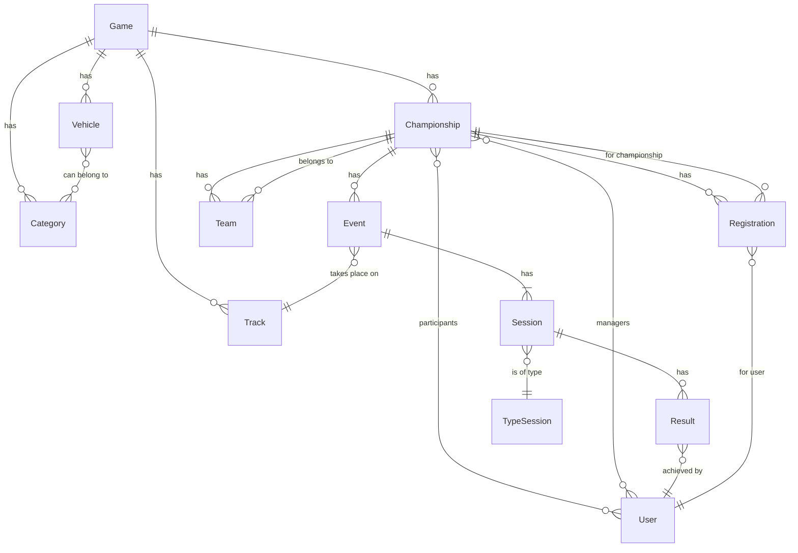

# Database Schema (ERD)

This diagram shows the relationships between the main entities in the database.

```mermaid
erDiagram
    Game ||--o{ Championship : "has"
    Game ||--o{ Track : "has"
    Game ||--o{ Vehicle : "has"
    Game ||--o{ Category : "has"

    Championship ||--o{ Event : "has"
    Championship ||--o{ Team : "has"
    Championship ||--o{ Registration : "has"
    Championship }o--o{ User : "participants"
    Championship }o--o{ User : "managers"

    Event ||--|{ Session : "has"
    Event }o--|| Track : "takes place on"

    Session ||--o{ Result : "has"
    Session }o--|| TypeSession : "is of type"

    Result }o--|| User : "achieved by"

    Team }o--|| Championship : "belongs to"

    Registration }o--|| User : "for user"
    Registration }o--|| Championship : "for championship"

    Vehicle }o--o{ Category : "can belong to"
```
